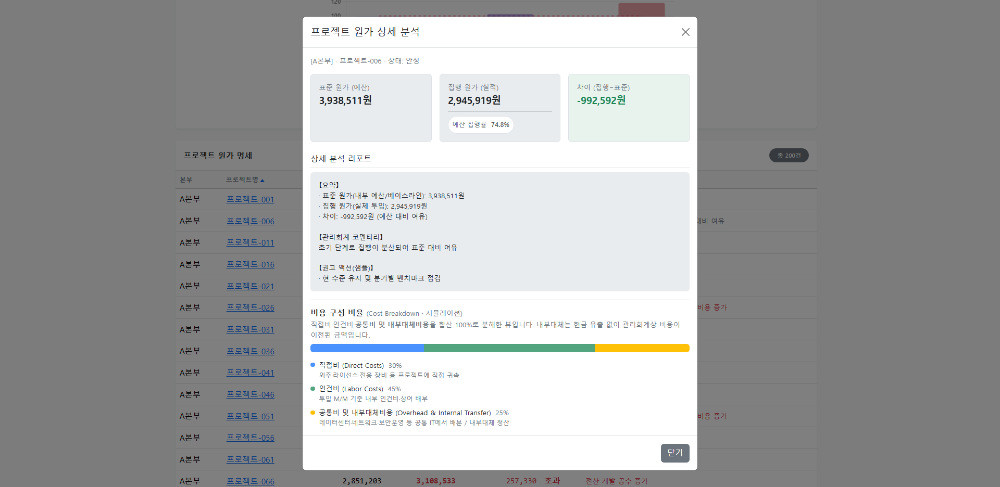

# 🏛️ 금융 자산운용 통합 백오피스 대시보드
> **지원자:** 이찬희 (나이에이티에스(주) 「바이브 코딩」 포트폴리오)
> **목적:** 데이터 수집(인터페이스 관제)부터 시각화(관리회계 대시보드)까지 이어지는 엔터프라이즈 데이터 파이프라인 프로토타입 구축

## 📌 프로젝트 개요
단순한 코드 생성을 넘어, 생성형 AI를 능동적인 '페어 프로그래머'이자 '아키텍트'로 활용하여 단기간에 복잡한 금융 비즈니스 로직을 구현한 통합 관제 시스템입니다. 
단순한 CRUD 게시판을 벗어나, **데이터 정합성을 보장하는 장애 재처리 로직**과 **경영진의 의사결정을 돕는 원가/예산 시각화**를 하나의 애플리케이션으로 통합하여 기획 및 개발했습니다.

---

## 🛠️ 기술 스택
| 구분 | 기술 |
|------|------|
| 언어 / 런타임 | Java 17 |
| 프레임워크 | Spring Boot 3.x |
| 데이터 접근 | Spring Data JPA |
| 데이터베이스 | H2 (In-memory) |
| 화면 / UI | Thymeleaf, Bootstrap 5 (CDN), Chart.js |
| **AI Orchestration** | **Gemini (의사결정 및 프롬프트 설계)**<br>**Cursor AI (코드 실행 및 IDE 환경)** |

---

## 🌟 핵심 기능 및 UX 디테일

### 메뉴 1 · 외부 기관 인터페이스 모니터링 (Data Gatherer)
전사 ERP, 구매, 인사 시스템 및 외부 기관과의 데이터 연동 상태를 관제하는 수문장 역할입니다.
* **실시간 장애 대응 (Retry):** 실패(`Fail`) 건 발생 시, Fetch API를 활용한 비동기 POST 요청으로 즉각적인 재처리 시뮬레이션 구현
* **현업 친화적 UX:** * 화면 가로 스크롤 시에도 '상태'와 '조치' 컬럼이 항상 보이도록 **Sticky 고정(틀 고정)** 적용
  * 긴 URL 엔드포인트 말줄임 처리 및 클릭 시 **클립보드 자동 복사 모달** 제공

### 메뉴 2 · 관리회계 원가·예산 대시보드 (Data Consumer)
관제 시스템을 통해 적재된 데이터를 바탕으로, 전사/본부/프로젝트 단위의 집행 현황을 시각화합니다.
* **다중 필터링 (Multi-Filtering):** 본부 및 상태(안정/초과) 조합의 교집합(AND) 필터링 구현 및 실시간 검색 건수 노출
* **의사결정 최적화 시각화 (Chart.js):** * 혼합 차트를 활용해 **100% 예산 기준선(Threshold)**을 붉은 점선으로 강조
  * 데이터 집중도를 높이기 위해 툴팁과 범례에서 불필요한 기준선 노이즈 제거
  * 특정 본부 필터링 시 상단 차트를 부드럽게 숨겨 하단 테이블 데이터에 집중할 수 있도록 UX 개선
* **전문가 리포트 모달:** 프로젝트별 상세 분석 시, **직접비/인건비/내부대체비용** 등의 비율을 가로 스택 바(Stacked Bar)로 시각화하여 관리회계 도메인 지식 반영

---

## 🧠 멀티 LLM 오퍼레이팅 및 프롬프트 엔지니어링 전략
본 프로젝트는 단순히 AI에게 코딩을 지시한 것이 아니라, **목적에 맞게 두 가지 AI 툴을 조율(Orchestration)하는 AI-Native 개발 방법론**을 적용했습니다. 지원자는 직접 코드를 타이핑하는 대신, 비즈니스 로직 설계와 결과물 검증을 담당하는 '시스템 아키텍트'의 역할에 집중했습니다.

1. **Gemini를 활용한 아키텍처 의사결정 (The Brain):**
   * 관리회계의 복잡한 도메인 지식(내부대체비용 정산, 예산 집행률 계산 등)을 시스템에 어떻게 녹여낼지 Gemini와의 심도 있는 대화를 통해 기획했습니다.
   * Cursor AI에게 지시할 **'메타 프롬프트(Meta-Prompt)'**를 Gemini를 통해 정교하게 설계하여 개발의 방향성을 통제했습니다.
2. **Cursor AI를 활용한 코드 실행 (The Hands):**
   * Gemini와 설계한 완벽한 프롬프트를 바탕으로, Cursor AI를 순수한 '실행 도구'로 활용하여 UI 컴포넌트와 백엔드 로직을 빠르고 정확하게 구현했습니다.
3. **UX 및 인지적 부하(Cognitive Load) 최적화:**
   * AI가 쏟아내는 정보 중 불필요한 시각적 노이즈(예: 차트 기준선의 툴팁 노출)를 식별하고, 의사결정자(경영진) 관점에서 화면의 집중도를 높이도록 AI에게 재지시하는 과정을 거쳤습니다.

---

## 🚀 실행 방법
별도의 DB 설치 없이 H2 인메모리로 즉시 실행 가능합니다.

1. 프로젝트 최상위(`build.gradle` 위치)에서 터미널을 열고 아래 명령어를 실행합니다.
   ```bash
   # Mac / Linux
   ./gradlew bootRun

   # Windows CMD / PowerShell
   .\gradlew.bat bootRun
   ```
2. 브라우저에서 **http://localhost:8080** 으로 접속합니다. 
   - 루트(`/`)는 인터페이스 모니터링 화면으로 리다이렉트됩니다.
   - 상단 네비게이션 바를 통해 원가 모니터링 화면으로 이동할 수 있습니다.

---

## 📸 스크린샷 (주요 기능)

### 1. 인터페이스 관제 - Sticky 스크롤 및 클립보드 복사


### 2. 원가 대시보드 - 다중 필터링 및 100% 기준선 시각화


### 3. 관리회계 상세 분석 - 내부대체비용 구성 비율 시각화 모달
