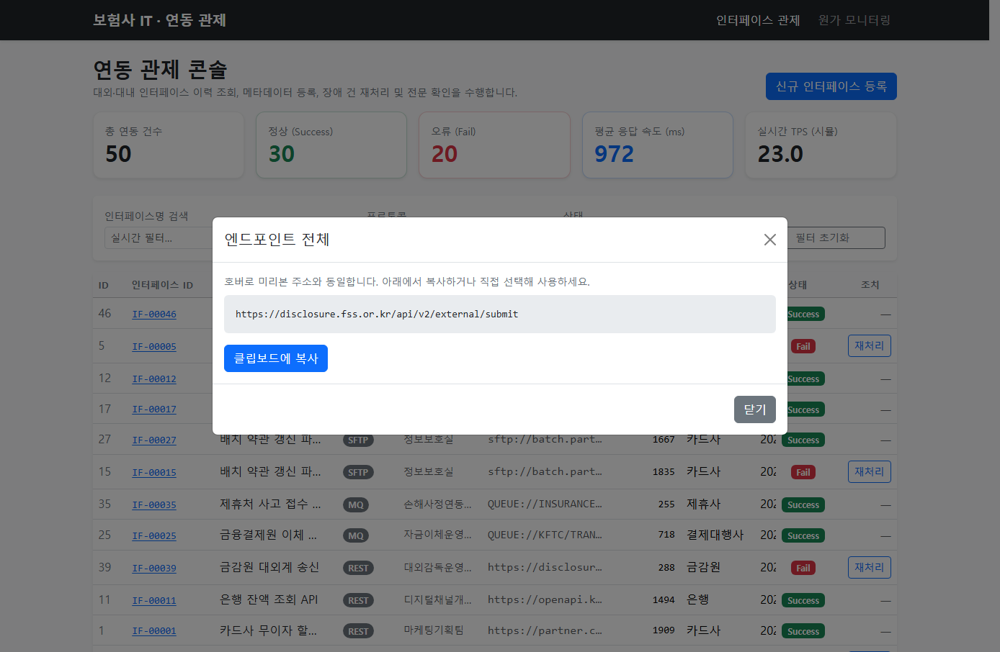
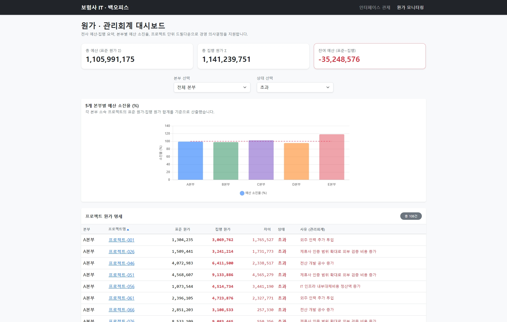

# [포트폴리오] 금융 자산운용 통합 백오피스 대시보드

**지원자:** 이찬희

---

## 프로젝트 개요

나이에이티에스(주) **「바이브 코딩」** 포트폴리오 제출용 프로젝트입니다.

AI(Cursor)를 활용해 단기간에 복잡한 비즈니스 로직을 통합한 **프로토타입**입니다. 대표적으로 **장애 재처리(인터페이스 상태 복구)**와 **원가·예산 관점의 집행 모니터링**을 한 애플리케이션에서 다룹니다.

---

## 기술 스택

| 구분 | 기술 |
|------|------|
| 언어 / 런타임 | Java 17 |
| 프레임워크 | Spring Boot 3.x |
| 데이터 접근 | Spring Data JPA |
| 데이터베이스 | H2 (In-memory) |
| 화면 | Thymeleaf |
| UI | Bootstrap 5 (CDN) |

---

## 핵심 기능

### 메뉴 1 · 외부 기관 인터페이스 모니터링

- 외부 기관 연동 **인터페이스 실행 이력** 조회
- 실패(`Fail`) 건에 대한 **장애 재처리**: 브라우저에서 **Fetch API**로 서버에 비동기 `POST` 요청 후, 성공 시 화면 갱신

### 메뉴 2 · 원가·예산 모니터링

- **5개 본부**, **200개 프로젝트** 수준의 원가·집행·상태(안정/초과) 시각화
- 본부별 **클라이언트 사이드 필터링**으로 테이블만 빠르게 전환 (추가 서버 요청 없음)

---

## 면접관을 위한 실행 방법

1. **별도 DB 설치는 필요 없습니다.** (H2 인메모리 사용)
2. 프로젝트 **최상위**(`build.gradle`이 있는 디렉터리)에서 터미널을 연 뒤 아래를 실행합니다.

   ```bash
   ./gradlew bootRun
   ```

   > **Windows CMD / PowerShell**에서는 다음처럼 실행할 수 있습니다.  
   > `.\gradlew.bat bootRun`

3. 브라우저에서 **http://localhost:8080** 으로 접속합니다.  
   - 루트(`/`)는 인터페이스 모니터링 화면으로 리다이렉트됩니다.  
   - 원가 화면은 상단 메뉴 **「원가 모니터링」**에서 이동할 수 있습니다.

---

## 화면 스크린샷

아래 경로는 **예시**입니다. 캡처한 이미지 파일을 프로젝트에 두고, 경로·파일명만 본인 환경에 맞게 수정해 주세요.

### 메뉴 1 · 인터페이스 모니터링



### 메뉴 2 · 원가 모니터링



> **팁:** `docs/screenshots/` 폴더를 만든 뒤 PNG를 넣고, 위 마크다운의 파일명을 실제 파일명과 맞추면 됩니다.
